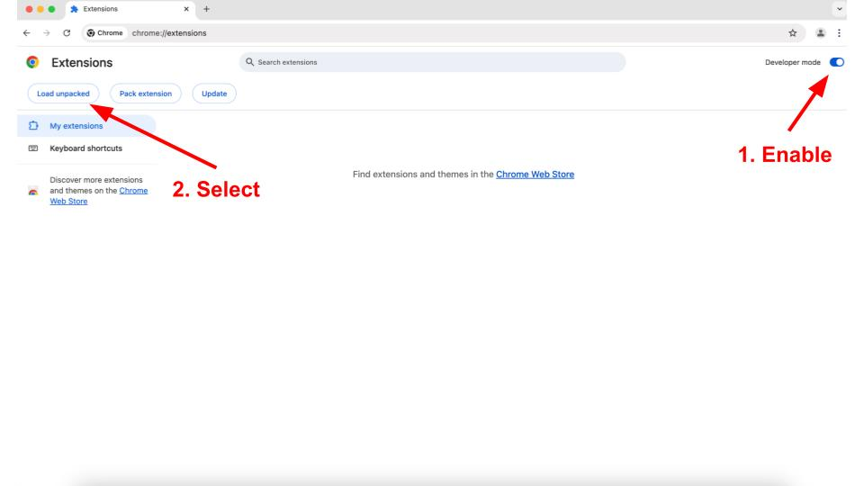
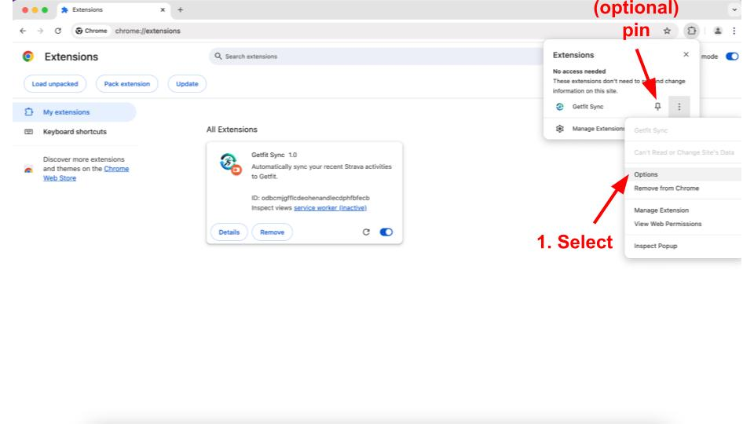

### 1. **Download & Unzip the Extension**

- **Download** the extension file and **unzip** it anywhere on your local drive. 📥🔓

---

### 2. **Load the Extension into Chrome**

- Open Google Chrome and type `chrome://extensions/` in the address bar.
- **Enable Developer Mode** by toggling the switch in the top right corner. 🔧
- Click on **"Load unpacked"** in the top left, then navigate to and select the folder where you unzipped the extension. 📂✅

<!-- Next we will include an image: imgs/dev_chrome.jpg -->

---

### 3. **Get Your Authorization Callback Domain**

- In your extensions list, **right-click** the new **getfit sync** extension. (Tip: you can pin it for quick access!)
- Select **"Options"**.
- **Copy** the **"Authorization Callback Domain"** displayed. 📋🔑

---

### 4. **Create a Strava App**

- Visit [Strava API](https://www.strava.com/settings/api). Log in, if prompted.
- Fill in your app details:
    - **Name, Description, and Icon:** Feel free to customize these! (Note: the icon is required – I’ve provided one for you if needed.) 🎨
    - **Club:** Leave this blank.
    - **Website:** Enter `http://localhost/exchange_token`
- **Paste** the **Authorization Callback Domain** you copied earlier into the appropriate field.
- Once created, you’ll receive a **Client ID** and **Client Secret**. Make sure to note these down! 🔐📝

---

### 5. **Configure the Extension with Strava Credentials**

- Return to the **Options** window of the getfit sync extension.
- **Enter** your Strava **Client ID** and **Client Secret**. 📥✨
- Hit "Save Configuration"
---

### 6. **Sync with getfit**

- Open [getfit](https://getfit.mit.edu/) and **log in** (if prompted). 👤💻
- Click on the **getfit sync extension icon** in your Chrome extensions menu.
- Press **"Sync Now"**. 🔄
- If prompted, **log in** to Strava and **allow access**. (Trust me – it’s all good!) 👍🔓

---

### 7. **Enjoy the Sync!**

- Once the sync completes, **refresh** the getfit page to see your updated data. 🎉🔄

---

Happy syncing! If you run into any issues, feel free to reach out. Enjoy your streamlined integration! 😄✨